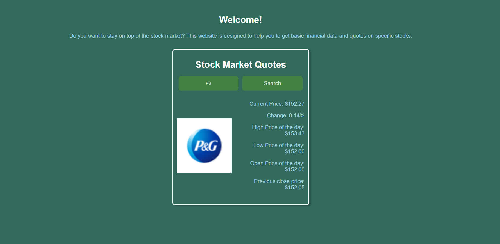

# Stock Market Website 🚀

# Description
This website enables user to enter a stock name or symbol and return its financial data

## How It's Made:
Tech used: 
- HTML
- CSS
- JavaScript
- API

## Lessons Learned:
- How to integrate API database into JS

## Notes
- Would like to commit better styling to website

## Future updates
- Adding a stock description, allow searches through stock name, and adding ticker graph widget

#### API Used
- Stock data API - https://aletheiaapi.com/
- Stock logo API - https://docs.logokit.com/api-reference/stock-logo-API 

